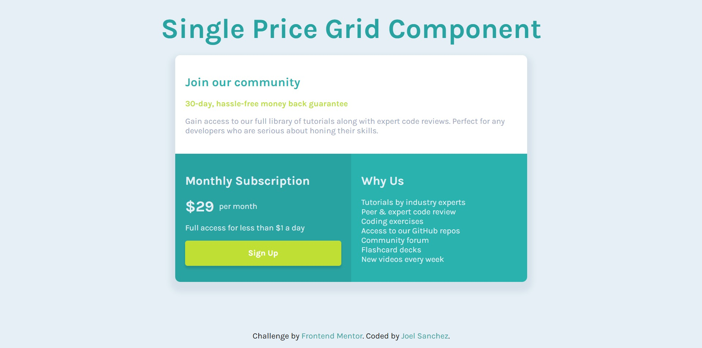

# Frontend Mentor - Single price grid component

This is a solution to the [Single price grid component challenge on Frontend Mentor](https://www.frontendmentor.io/challenges/single-price-grid-component-5ce41129d0ff452fec5abbbc).

## Table of contents

- [Overview](#overview)
  - [Screenshot](#screenshot)
  - [Links](#links)
- [Built with](#built-with)

## Overview

### Screenshot

### Links

- Solution URL: [Github](https://github.com/joel-development/frontendmentor---challenge-1)
- Live: [Github Pages](https://joel-development.github.io/frontendmentor---challenge-1)

## Built with

- Semantic HTML5 markup
- CSS custom properties
- Flexbox
- BEM methodology
- Mobile-first workflow
